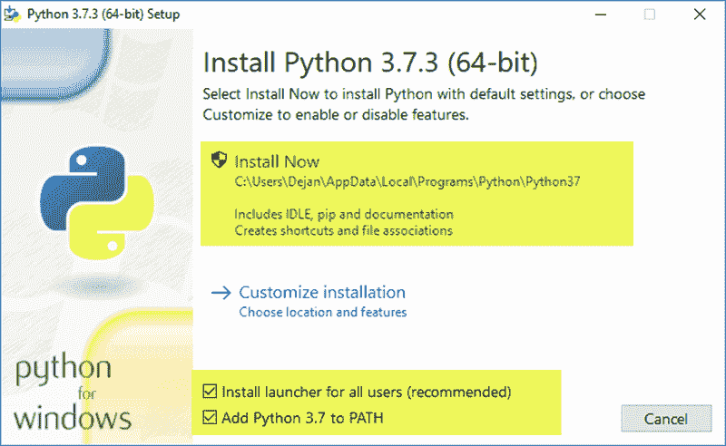

# 如何运行 Python 脚本

> 原文：<https://www.pythoncentral.io/how-to-run-python-scripts/>

## 范围

在本文中，我们将了解更多关于如何运行 Python 脚本的信息。您应该熟悉 Python 语法。如果你对 Python 了解不多，查看我们的指南[这里](https://www.pythoncentral.io/what-is-python-used-for/)。你需要在你的机器上安装 Python。要知道如何在你的系统上安装 python，请查看我们的[安装指南](https://www.pythoncentral.io/?p=4685&preview=true)。

我们将讨论:

*   如何更新 python
*   运行 Python 脚本
*   在终端中运行 python
*   Python 中的注释

## 如何更新 Python:

我们在上一篇文章中讨论了如何安装 Python。总是建议使用最新版本的 Python。这会让你避免很多问题。在每次更新中，Python 都添加了新的修复和增强。更新 python 将使利用新的修复。要更新 Python 版本，您需要首先检查您的操作系统。

### 在 windows 中更新 python

1.  访问 Python 官方页面
2.  下载最新的 Python 版本
3.  它会下载一个. exe 文件。
4.  打开它，然后像安装一样继续。
5.  它将更新你机器上安装的 Python 版本。

[](https://www.pythoncentral.io/wp-content/uploads/2020/08/python-setup.png)

为 windows 设置 python

### 在 Ubuntu 中更新 Python

在 Ubuntu 中更新 Python 是一个简单的命令。

1.  更新 apt 包管理器

    ```
    sudo apt update && sudo apt-get upgrade
    ```

2.  安装最新版本的 Python。

    ```
    sudo apt install python3.8.2
    ```

这将把 Python 版本更新到 3.8.2。

### 在 Mac 中更新 Python

1.  访问 Python [官方页面](https://www.python.org/downloads/mac-osx/)
2.  下载最新的 Python 版本
3.  它会下载一个文件。
4.  打开它，然后像安装一样继续。
5.  它会更新你 macOS 上安装的 Python 版本。

全局更新 Python 可能不是一个好主意。我们在上一篇文章中了解到，在 Python 项目中最好使用虚拟环境。在大多数情况下，您只需要在虚拟环境中更新 python 版本。

```
python -m venv --upgrade <env_directory>
```

这只会更新虚拟环境中的 python 版本。

确保安装了 Python 之后。而且是最新版本。现在您可以运行 Python 脚本了。

## 运行 Python 脚本

通常，python 脚本看起来像这样

```
import os 

def main():
    path = input("Enter folder path: ")
    folder = os.chdir(path)

	for count, filename in enumerate(os.listdir()): 
		dst ="NewYork" + str(count) + ".jpeg"
		os.rename(src, dst) 

if __name__ == '__main__':
	main()
```

它的主要功能是脚本逻辑。这段代码是脚本的主要功能。它实际上定义了你需要做什么。调用主函数的另一部分是

```
if __name__ == '__main__':
	main()
```

首先，定义包含你的代码的函数。Python 将输入 if __name__ == '__main__ ':条件并调用 main()函数。我们需要知道幕后发生了什么。

1.  解释器读取 python 源文件。解释器设置 __name__ 特殊变量，并将其赋给“__main__”字符串。
2.  这将告诉解释器运行它内部调用的函数。在我们的例子中，它是 main()函数。

脚本是 Python 最大的特性之一。为了实现这一点，Python 需要使它的代码在不同的地方可执行。

## 在终端中运行 python 脚本

您可以从终端运行 Python 代码。可以写 python <file_name.py>。这将告诉 Python 解释器运行这个文件中的代码。</file_name.py>

```
python my_script.py
```

这将调用脚本中的 main 函数并执行逻辑。如果您需要从终端自动完成一些工作，像这样的功能非常有用。假设您是 DevOps，每次启动机器时，您都需要记录时间和用户。您可以编写 Python 代码来检查登录用户的时间和用户名。它会在每次有人登录并运行机器时用这些数据更新日志文件。在这种情况下，您不能手动打开文件。您将在系统启动命令中添加运行该脚本的命令。

您可以在终端中打开 Python shell。它会帮助你直接执行你的代码。有了这个，你就不需要每次想测试新的变化时都要重新运行脚本了。您可以编写您的脚本，并在同一个地方进行测试。这会帮助你更快地开发脚本。

## Python 脚本中的注释

Python 因其可读性而大放异彩。注释可以帮助你解释更多从代码中难以理解的逻辑。添加注释有助于您的同事理解复杂的逻辑。评论在团队中很有帮助。它帮助团队成员了解代码每一部分的原因。这使得工作变得容易，并使开发过程更快。在 python 中添加注释只是通过添加 hash。

```
# the below code will print items from 1 to 5
for x in range(1, 5):
    print(x)
```

请注意，#符号后面的代码将不会运行。Python 将这段代码视为注释。它不会执行它

## 结论

您可以从系统 GUI 或终端运行 Python 脚本。看你想怎么用了。Python 中的注释用于在代码中添加人类可读的文本。Python 注释以散列符号开始。Python 解释器跳过散列文本。更新 python 很重要。它让您了解最新的修补程序。您可以在整个系统中全局更新 Python。最有效的是在你的[虚拟环境](https://docs.python.org/3/tutorial/venv.html)中更新 Python 版本。在大型项目中，它有助于保持事物的安全，而不是破坏它。