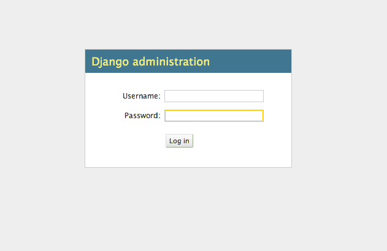
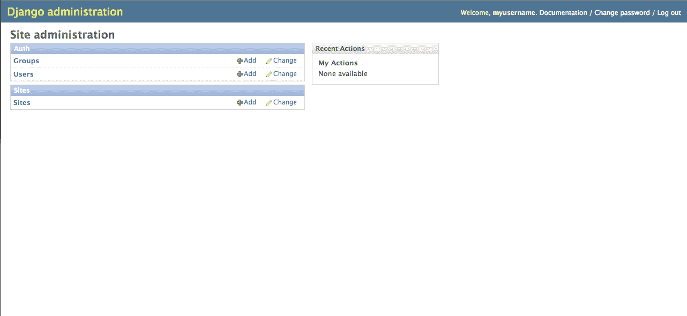
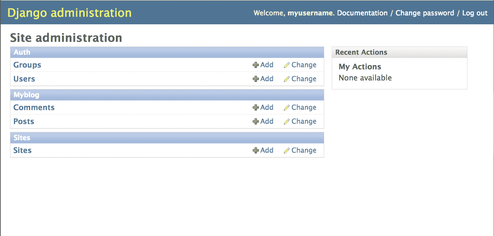
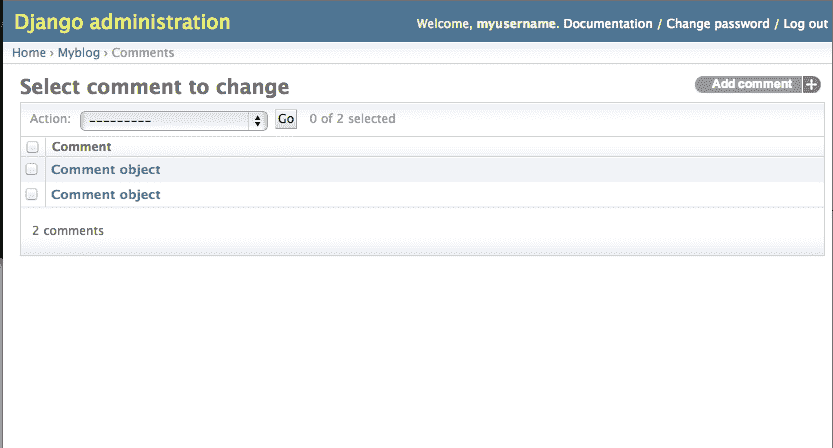
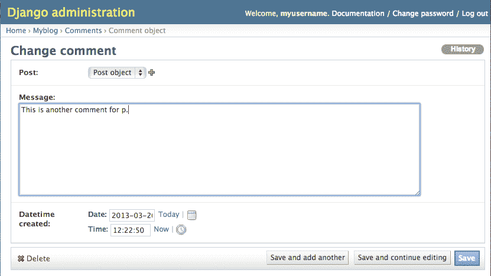
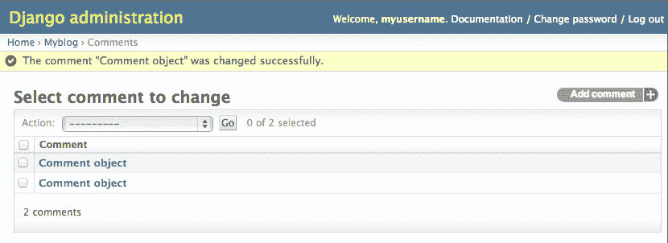

# 激活 Python Django 网站的管理应用程序

> 原文：<https://www.pythoncentral.io/activate-admin-application-for-your-python-django-website/>

在上一篇文章中，我们学习了如何为 Django 应用程序`myblog`编写两个模型`Post`和`Comment`。在这篇文章中，我们将学习如何激活 Django 的自动管理站点，该站点为您网站的用户或管理员`myblog`创建、阅读、更新和删除( *CRUD* )您网站的内容提供了一个方便的界面。CRUD 操作是持久存储的四个基本功能。缩写词 *CRUD* 描述了一组在任何基于数据库的计算机应用程序中几乎都很常见的操作。由于这些操作是常识，从现在开始，我们将在本系列中使用 *CRUD* 。

## **什么是 Django 管理站点，如何激活它**

Django 管理站点是一个应用程序，它是由命令`django-admin.py startproject`创建的任何新 Django 项目的默认应用程序。几乎可以肯定的是，任何基于数据库的网站都应该允许用户对其内容进行 *CRUD* ，Django 提供了一个现成的管理站点，它是任何新的 Django 项目的一部分。

默认情况下，Django 管理站点是不激活的，因为不是所有的程序员都想启用它。为了实现它，您需要做三件事:

*   取消对`myblog/settings.py`
    【python】
    中`INSTALLED_APPS`中`django.contrib.admin`和`django.contrib.admindocs`的注释= (
    'django.contrib.auth '，
    ' django . contrib . content types '，
    'django.contrib.sessions '，
    'django.contrib.sites '，
    'django.contrib.messages '，
    ' django . contrib . static files '，
    #取消对下一行的注释
*   Uncomment the following lines in `myblog/urls.py`:
    [python]
    from django.contrib import admin
    admin.autodiscover()url(r'^admin/doc/', include('django.contrib.admindocs.urls')),

    url(r'^admin/'，包括(admin.site.urls))，

    现在，您应该有一个类似这样的`myblog/urls.py`:

    ```

    from django.conf.urls import patterns, include, url
    #取消对下面两行的注释，以启用 django.contrib 中的 admin:
    import admin
    admin . auto discover()
    urlpatterns = patterns('，
     #示例:
     # url(r'^$'，' myblog.views.home '，name='home ')，
     # url(r'^myblog/'，include('myblog.foo.urls ')，
    #取消对下面的管理/文档行的注释以启用管理文档:
     url(r'^admin/doc/'，包括(' django.contrib.admindocs.urls ')，
    #取消注释下一行以启用 admin: 
     url(r'^admin/'，include(admin.site.urls))，
     ) 

    ```

*   在您的 shell 中运行以下命令:
    【shell】
    % python manage . py syncdb
    创建表...
    创建表 django_admin_log
    安装定制 SQL...
    安装索引...
    已从 0 个设备
    [/shell]安装 0 个对象由于管理应用程序`django.contrib.admin`已在`myblog/settings.py`中取消注释，您应该重新运行`syncdb`命令为其创建数据库表。注意，这个命令已经创建了一个新表`django_admin_log`。

### **享受管理网站的乐趣**

**现在，您可以通过**访问管理网站

*   运行网站:
    【shell】
    % python manage . py runserver
    验证模型...发现 0 个错误
    2013 年 04 月 05 日- 12:08:17
    Django 版本 1.5，使用设置‘my blog . settings’
    开发服务器运行在 http://127.0.0.1:8000/
    用 CONTROL-C 退出服务器
    [/shell】
*   打开 web 浏览器，导航到 http://127.0.0.1:8000/admin。你应该可以看到 admin 的登录界面:
    

现在，您可以使用您在文章中创建的超级用户的凭证登录。如果您忘记了超级用户的密码，可以通过以下方式修改其密码:

```

>>> from django.contrib.auth import models as m

>>> m.User.objects.all()

[]

>>> superuser = m.User.objects.all()[0]

>>> superuser.set_password('12345')

>>> superuser.save()

```

登录后，您应该能够看到以下通用管理主页:


请注意，型号`Post`和`Comment`未在此页面列出。因此，我们应该通过在目录`myblog/`中创建一个新文件`admin.py`来添加它们，如下所示:

```

from django.contrib import admin

from myblog import models as m
管理员网站注册(m.Post) 
管理员网站注册(m.Comment) 

```

现在，通过终止命令`python manage.py runserver`重启 Django 开发服务器，并重新运行它。尽管 Django 开发服务器监听目录`myblog/`中的文件变化，并在每次有文件变化时自动重启，但如果有文件创建，它不会自动重启。

现在您可以访问页面*http://127 . 0 . 0 . 1:8000/admin*并看到模型`Post`和`Comment`已经被添加到 myblog 应用程序中。

### **使用管理站点**修改模型

现在您可以点击“评论”来查看数据库中存储的评论列表:


点击第一个“评论对象”将显示一个基于 HTML 表单的页面，允许您修改`message` *文本*字段、`created` *日期时间*字段和`post` *外键*字段:


现在你可以把任何一个字段改成你喜欢的值:


完成修改后，可以点击“保存”将修改保存到数据库:


**有几点值得注意:**

*   `Post`、`Comment`等机型变更表格由`myblog/models.py`中定义并在`myblog/admin.py`中注册的机型自动生成
*   不同的模型字段类型，例如用于`Comment.created_at`的类型`DateTimeField`和用于`Comment.message`的类型`TextField`，对应于不同种类的 HTML `input`元素。

### **总结和见解**

我们已经用几行代码激活了 Django 的管理站点，由此产生的 URL“/Admin”为网站管理员提供了一个全功能的 web 界面，以便通过`admin.site.register()`函数注册 *CRUD* 任何模型。虽然这看起来像魔术，但它是**不要重复自己** ( *干*)原则的体现。我们编写的激活管理站点的代码保持在绝对最小的程度，你当然可以想象如果 Django 不提供管理站点，我们要编写多少代码。

在本系列接下来的文章中，我们将反复拜访和考察*干*原理。由于 *DRY* 促进了代码的可重用性和面向可维护性的设计，Django 的开发者将它作为实现 Django 框架的指导方针，我们在编写软件时也应该记住这一点。