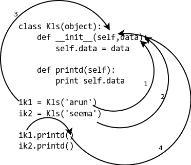

# Python 中@staticmethod 和@classmethod 的区别

> 原文：<https://www.pythoncentral.io/difference-between-staticmethod-and-classmethod-in-python/>

## Python 中的类与静态方法

在本文中，我将尝试解释什么是`staticmethod`和`classmethod`，以及它们之间的区别。`staticmethod`和`classmethod`都使用装饰器将方法定义为`staticmethod`或`classmethod`。请阅读文章 [Python Decorators Overview](https://www.pythoncentral.io/python-decorators-overview/ "Python Decorators Overview") ，对 Decorators 如何在 Python 中工作有一个基本的了解。

## **简单、静态和类方法**

类中最常用的方法是实例方法，即实例作为第一个参数传递给方法。

例如，基本的实例方法如下:

```

class Kls(object):

def __init__(self, data):

self.data = data
def printd(self): 
打印(self.data)
ik1 = Kls(' arun ')
ik2 = Kls(' Seema ')
ik1 . printtd()
ik2 . printtd()

```

这为我们提供了以下输出:

```

arun

seema

```

[](https://www.pythoncentral.io/wp-content/uploads/2013/02/instancemethod.png)

查看代码示例和图表后:

*   在 1 和 2 中，参数被传递给方法。
*   在 3 上，`self`参数指的是实例。
*   在 4 中，我们不需要向方法提供实例，因为它由解释器本身处理。

现在，如果我们要编写的方法只与类交互，而不与实例交互，该怎么办呢？我们可以在类之外编写一个简单的函数来实现这一点，但是这会将与类相关的代码分散到类之外。这可能会导致未来的代码维护问题，如下所示:

```

def get_no_of_instances(cls_obj):

return cls_obj.no_inst
Kls 类(对象):
 no_inst = 0
def __init__(self): 
 Kls.no_inst = Kls.no_inst + 1
ik1 = Kls() 
 ik2 = Kls()
print(get _ no _ of _ instances(Kls))

```

为我们提供了以下输出:

```

2

```

## **Python @ class method**

我们现在要做的是在类中创建一个函数，它让类对象而不是实例工作。如果我们想得到实例的数量，我们所要做的就是下面这样的事情:

```

def iget_no_of_instance(ins_obj):

return ins_obj.__class__.no_inst
Kls 类(对象):
 no_inst = 0
def __init__(self): 
 Kls.no_inst = Kls.no_inst + 1
ik1 = Kls() 
 ik2 = Kls()【打印 IGES _ no _ of _ instance(ik1)】

```

2

```

使用 Python 2.2 之后引入的特性，我们可以使用`@classmethod`在类中创建一个方法。

```

class Kls(object):

no_inst = 0
def __init__(self): 
 Kls.no_inst = Kls.no_inst + 1
@ class method
def get _ no _ of _ instance(cls _ obj):
return cls _ obj . no _ inst
ik1 = Kls() 
 ik2 = Kls()
print ik1 . get _ no _ of _ instance()
print kls . get _ no _ of _ instance()

```

我们得到以下输出:

```

2

2

```

这样做的好处是:无论我们从实例还是从类中调用方法，它都将类作为第一个参数传递。
**Python @ static method**
通常有些功能与类相关，但不需要类或任何实例来完成某些工作。比如设置环境变量，改变另一个类的属性等等。在这些情况下，我们也可以使用一个函数，但是这样做也会传播相关的代码，这会导致以后的维护问题。
这是一个示例案例:

```

IND = 'ON'
def checkind():
return(IND = = ' ON ')
Kls 类(object): 
 def __init__(self，data): 
 self.data = data
def do _ Reset(self):
if checkind():
print(' Reset done for:'，self.data)
def set _ DB(self):
if checkind():
self . DB = '新数据库连接'
 print('数据库连接为:'，self.data)
ik1 = kls(12)
1 到 _reset() 
 ik1.set_db() 
的缩写形式
```

这为我们提供了以下输出:

```

Reset done for: 12

DB connection made for: 12

```

这里如果我们使用一个`@staticmethod`，我们可以把所有的代码放在相关的地方。

```

IND = 'ON'
Kls 类(object): 
 def __init__(self，data): 
 self.data = data
@ static method
def checkind():
return(IND = = ' ON ')
def do _ Reset(self):
if self . checkind():
print(' Reset done for:'，self.data)
def set _ DB(self):
if self . checkind():
self . DB = '新数据库连接'
 print('数据库连接为: '，self.data)
ik1 = kls(12)
1 到 _reset() 
 ik1.set_db() 
的缩写形式
```

这为我们提供了以下输出:

```

Reset done for: 12

DB connection made for: 12

```

下面是一个更全面的代码示例，用图表向您展示
@staticmethod 和@classmethod 有何不同。

```

class Kls(object):

def __init__(self, data):

self.data = data
def printd(self): 
打印(self.data)
@ Static method
def s method(* arg):
print(' Static:'，arg)
@ Class method
def cmethod(* arg):
print(' Class:'，arg)
[/python]
【python】
>>>ik = Kls(23)
>>>ik . printd()
23
>>>ik . smethod()
Static:()
>>>ik . cmethod()【t】Kls' >，)
>>>Kls . printd()
type error:必须以 Kls 实例作为第一个参数调用未绑定方法 printd()(改为 get nothing)
>>>Kls . s method()
Static:()
>>>Kls . cmethod()
Class:(<Class ' _ _ main _ _。Kls' >，)

```

这里有一个图表来解释这是怎么回事:
 [](https://www.pythoncentral.io/wp-content/uploads/2013/02/comparison.png) 

```