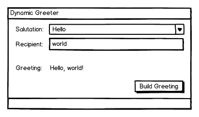

# PySide/PyQt 教程:交互式小部件和布局容器

> 原文：<https://www.pythoncentral.io/pyside-pyqt-tutorial-interactive-widgets-and-layout-containers/>

在上一期文章中，我们查看了为所有继承了`QWidget`的 Qt 小部件提供的一些功能，并且更深入地查看了一个特定的小部件`QLabel`。我们还通过一个例子展示了一个简单的 Python/Qt 应用程序的结构。然而，到目前为止，我们还不能做任何让用户非常满意的事情；我们的应用程序可以向它们显示文本。你可以称之为独白盒。我们需要一些方法让用户与我们的程序互动，把我们的独白变成对话。Qt 提供了丰富的交互式小部件，我们将在这里考虑一些更简单的小部件；我们将使用它们来探索如何在表单上布置小部件。在下一期中，我们将学习如何让我们的应用程序使用插槽和信号来响应用户交互；这一次，我们将讨论如何创建小部件并在表单上展示它们，包括一个使用我们所学内容的简单示例。

## 交互式小工具

Python/Qt 使得允许用户交互变得容易；它有一组非常简单、明智的小部件，并且它们很容易连接到您的应用程序的逻辑。我们来看几个。

## 小跟班

允许用户与应用程序交互的最简单的方法之一是让他们点击一个按钮。不出所料，Qt 有那些，叫做`QPushButton`。`QPushButton`构造函数有三个有效的签名:

```

QPushButton(parent=None)

QPushButton(text, [parent=None])

QPushButton(icon, text, [parent=None])

```

`parent`参数是一个`QWidget`，`text`是一个 Python 字符串或`unicode`，`icon`是一个`QIcon`。要创建一个标题为“Go”的属于`some-form`的按钮，我们要做:

```

go_button = QPushButton('Go', some_form)

```

如果我们想要一个快捷键，比如说 Alt-G，我们可以在 Go 中的 G 之前添加一个&符号:

```

go_button = QPushButton('&amp;Go', some_form)

```

在大多数平台上,“G”还会带有下划线。

使用按钮还可以做其他一些事情。以上面的`go_button`为例，您可以通过调用:

```

go_button.setDefault(True)

```

你可以把它弄平:

```

go_button.setFlat(True)

```

将`False`传递给任何一个方法都会产生相反的效果。一个按钮被点击时会弹出一个菜单；为此，向按钮的`setMenu`方法传递一个`QMenu`对象。(我们将在以后的文章中研究菜单。)

## 文本框

Qt 的 textbox 控件叫做`QLineEdit`；它允许用户输入和/或编辑单行纯文本。它有两个构造函数签名:

```

QLineEdit(parent=None)

QLineEdit(text, [parent=None])

```

两者之间唯一的区别是，第二个将包含在`QLineEdit`中的文本设置为`text`。`QLineEdit`对象有很多方法，但是我们将关注一些最基本的方法。可以用`text()`方法检索其文本，用`setText(text)`设置，用`setMaxLength(chars)`设置可以输入的最大字符数。使用`setReadOnly(True)`可以使其为只读，并且可以使用`setPlaceholderText(text)`添加占位符文本。A `QLineEdit`有更高级的属性:可以设置验证器和输入掩码，处理选择和撤销历史，等等；我们稍后会谈到这一点。

## 组合框

`QComboBox`小部件用于向用户提供大量文本或文本/图标选择，用户必须从中选择一个。(对于多选，请参见`QListView`和`QListWidget`——我们就要到了。)它的构造函数只接收一个父级:

```

QComboBox(parent)

```

构建起来很简单，但是在中还没有任何东西*。您可以通过多种方式之一添加项目。如果您的所有项目都是文本的，您可以使用`addItems(texts)`，其中`texts`是一个字符串项目列表。要单独添加项目，您可以使用`addItem`，它有两个有效签名:*

```

addItem(icon, text, [userData=None])

addItem(text, [userData=None])

```

其中`icon`是一个`QIcon`，`text`是一个`unicode`对象，`userData`是任何对象。您可以使用`insertItem`插入项目:

```

insertItem(index, icon, text, [userData=None])

insertItem(index, text, [userData=None])

```

或者，如果您的所有项目都是文本的，请选择`insertItems(texts)`。QComboBox 是一个灵活的小部件，用它可以做更多的事情，但这只是一个开始。

# 示例应用程序:概述

接下来，我们将学习如何将小部件组合到一个表单布局中——但是在此之前，让我们简要地看一下这一期的示例应用程序。

# 

如您所见，这是一个非常简单的应用程序。用户可以选择一个称呼并输入他们想要问候的人(或其他实体)的姓名，当他们单击“建立问候”时，问候将显示在表单上的标签上。我们将在下一节中展示的就是这种形式。

# 布局管理

PySide 和 PyQt 有两种布局管理方法:绝对定位，开发人员必须指定每个小部件的位置和大小；使用布局容器，将小部件以多种排列方式之一放入表单中，并自动处理大小和位置。我们将使用这两种方法为上面描述的示例应用程序构建一个接口。

## 绝对定位

要设置小部件在窗口中的物理位置，可以使用小部件的`move(x, y)`方法；`x`和`y`分别是从表单左上角到小部件左上角的水平和垂直距离。这是我们的表单，使用绝对定位创建:

```

# Every Qt application must have one and only one QApplication object;

# it receives the command line arguments passed to the script, as they

# can be used to customize the application's appearance and behavior

qt_app = QApplication(sys.argv)
class AbsolutePositioningExample(q widget):
' ' ' py side 绝对定位的例子；主窗口
继承了 QWidget，这是一个方便的空窗口小部件。'
 def __init__(self): 
 #将对象初始化为 QWidget 
 QWidget。__init__(self)
#我们必须自己设置主窗口的大小
 #因为我们控制了整个布局
 self.setMinimumSize(400，185) 
 self.setWindowTitle('动态迎宾')
#以此对象为父对象创建控件，并单独设置它们的位置；每一行都是一个标签，后跟
 #另一个控件
#称呼选择器的标签
self . Salutation _ LBL = q Label(' Salutation:'，self)
self . Salutation _ LBL . move(5，5) #从左上偏移第一个控件 5px
# self . Salutations =[' Ahoy '，
 'Good day '，
 'Hello '，【T6]' Heyo '，
 'Hi '，
 'Salutations '，
' was up '，
' Yo ']]
#在标签和组合框之间的
 #最左边，以及在最右边的
# self . salutation . setminimumwwidth(285)
#将它放置在标签末端右侧五个像素处
 self.salutation.move(110，5)
#收件人控件的标签
self . Recipient _ LBL = q label(' Recipient:'，self) 
 # 5 像素缩进，比最后一对小部件低 25 像素
 self.recipient_lbl.move(5，30)
#收件人控件是一个输入框
self . recipient = QLineEdit(self)
#添加一些幽灵文本来指示要输入什么样的内容
self . recipient . setplaceholdertext(&quot；例如“world”或“Matey”&quot；)
 #与称呼宽度相同
self . recipient . set minimum width(285)
#与称呼缩进相同但低 25 像素
 self.recipient.move(110，30)
# Greeting 小部件的标签
self . Greeting _ LBL = q label(' Greeting:'，self) 
 #与其他小部件缩进相同，但低了 45 个像素，因此它具有
 #物理分隔，表示函数的不同
 self.greeting_lbl.move(5，75)
greeting 小部件也是一个标签
 self.greeting = QLabel('，self) 
 #与其他控件一样缩进
 self.greeting.move(110，75)
build 按钮是一个按钮
self . build _ button = q push button(&amp；建立问候，自我)
#放在右下角，比
 #其他互动小工具
self . build _ button . setminimumwidth(145)
self . build _ button . move(250，150)
def run(self): 
 #显示表单
 self.show() 
 #运行 Qt 应用程序
 qt_app.exec_()
#创建应用程序窗口的实例并运行它
app = AbsolutePositioningExample()
app . run()

```

不用说，这在严肃的应用程序中会变得很麻烦。它也不能很好地响应调整大小；标签就放在指定的位置上。不仅如此，想象一下如果一个有视觉障碍的用户把他们的字体设置得特别大；您为控件设置的固定位置将不再适用。

## 布局容器

出于所有这些原因，布局容器比绝对定位使用得更频繁；它们更加灵活，可以减轻程序员计算精确位置的负担，并且可以调整布局以适应不同平台的 GUI 指南，如 Windows、GTK+、KDE 和 Mac OS X，以及不同用户的偏好。有五个主要的布局容器，每个容器都从 QLayout 开始:

*   QHBoxLayout
*   QVBoxLayout
*   QGridLayout
*   QStackedLayout
*   QFormLayout

每个都有不同的目的。简单来说，`QHBoxLayout`和`QVBoxLayout`分别在水平和垂直方向一个接一个地排列小部件；`QGridLayout`将它们排列成任意大小的表格；`QStackedLayout`将它们一个接一个地排列起来，允许它们根据需要出现在最前面；而`QFormLayout`是一种特殊的两列网格排列，它提供了特殊的方法来排列第一列有标签、第二列有相关控件的常见表单。这些布局本身就足够有用，但是您的布局选项并不仅限于此:您还可以将布局嵌套在其他布局中，以便为您的用户界面创建更复杂、更灵活的模式。现在，我们将考虑垂直和水平的盒子布局和`QFormLayout`。

### QVBoxLayout 和 qhboxlayout

盒子的布局相当简单。要使用一个作为顶级布局，您只需创建布局——其构造函数不需要参数——并使用名副其实的`addWidget`方法向其添加小部件。然后，将它设置为它所属的窗口的布局。例如:

```

T the window

win = QWidget()
#三个标签
LBL _ 1 = q label(&quot；我们是&quot；)
LBL _ 2 = q label(' stacked ')
LBL _ 3 = q label(' up)
# A 垂直方框布局
 layout = QVBoxLayout()
#将小部件添加到布局中
layout . Add widget(LBL _ 1)
layout . Add widget(LBL _ 2)
layout . Add widget(LBL _ 3)
#将布局设置为窗口的布局
 win.setLayout(layout) 

```

一个`QHBoxLayout`可以被同样地使用，尽管它很少作为顶层布局。它是最常见的子布局。要将子布局添加到另一个布局，使用布局的`addLayout`方法，例如:

```

layout = QVBoxLayout()

sub_layout = QHBoxLayout()
# ...用小部件填充布局...
layout . add layout(sub _ layout)

```

盒子布局还有另一个有价值且常用的方法:`addStretch`。一个常见的布局有许多控件静态地位于一个盒子布局的一端，一些位于另一端，中间有灵活的空白空间。为此，在框的开头添加小部件，添加一个拉伸因子大于零的拉伸，即`layout.addStretch(1)`；然后添加其余的小部件。

### QFormLayout

除了每一行可以很容易地分成两列而不需要创建嵌套布局之外，`QFormLayout`与`QVBoxLayout`非常相似。这是使用表单布局的`addRow`方法完成的，该方法被大量重载。单参数版本:

```

addRow(QWidget)

addRow(QLayout)

```

在整个`QFormLayout`的末尾添加小部件或布局。双参数版本:

```

unicode, QLayout

unicode, QWidget

QWidget, QWidget

QWidget, QLayout

```

在第一列中添加初始元素作为“标签”，在第二列中添加第二个元素。`unicode`参数被用作`QLabel`的文本；`QWidget`可以是任何小部件。

## 方框布局示例

既然我们已经有了如何创建交互式小部件并以更灵活的布局排列它们的基本想法，让我们以更简单、更灵活的方式重新创建我们的界面。我们窗口的主布局将是一个`QVBoxLayout`，有两个子布局，一个`QFormLayout`包含所有带标签的控件，一个`QHBoxLayout`管理按钮在右下角的位置。我们将使用`addStretch`将`QFormLayout`与`QHBoxLayout`分开，并将按钮推到`QHBoxLayout`的最右侧。您可能会注意到，下面的代码与绝对定位示例相比没有什么变化；例如，在如何创建单个控件方面没有区别。

```

qt_app = QApplication(sys.argv)
class layout example(q widget):
' ' ' py side/PyQt 绝对定位的例子；主窗口
继承了 QWidget，这是一个方便的空窗口小部件。''
def __init__(self): 
 #将对象初始化为 QWidget，
 #设置其标题和最小宽度
 QWidget。_ _ init _ _(self)
self . setwindowtitle('动态迎宾')
self . setminimumwwidth(400)
#创建布局整个表单的 QVBoxLayout
self . layout = QVBoxLayout()
#创建管理带标签控件的表单布局
self . form _ layout = QFormLayout()
#我们希望提供的问候语
 self.salutations = ['Ahoy '，
 'Good day '，
 'Hello '，
 'Heyo '，
 'Hi '，
 'Salutations '，
 'Wassup '，
 'Yo']
#创建并填充组合框以选择称呼
self . salutation = QComboBox(self)
self . salutation . additems(self . salutations)
#将其添加到带有标签
self . form _ layout . addrow(&amp；称呼:'，self.salutation)
#创建条目控件以指定收件人
 #并设置其占位符文本
self . recipient = QLineEdit(self)
self . recipient . setplaceholdertext(&quot；例如“世界”或“伙伴”&quot；)
#将其添加到带有标签
self . form _ layout . addrow(&amp；收件人:'，自我收件人)
#创建并添加标签以显示问候语文本
 self.greeting = QLabel('，self)
self . form _ layout . addrow(' Greeting:'，self.greeting)
#将表单布局添加到主 VBox 布局
self . layout . Add layout(self . form _ layout)
# Add stretch 将表单布局与按钮
 self.layout.addStretch(1)分开
#创建一个水平的框布局来放置按钮
 self.button_box = QHBoxLayout()
# Add stretch 将按钮推到最右边
self . button _ box . Add stretch(1)
#创建标题为
self . build _ button = q push button(&amp；建立问候，自我)
#将其添加到按钮框
self . button _ box . Add widget(self . build _ button)
#将按钮框添加到主 VBox 布局的底部

#将 VBox 布局设置为窗口的主布局
 self.setLayout(self.layout)
def run(self): 
 #显示表单
 self.show() 
 #运行 qt 应用程序
 qt_app.exec_()
#创建应用程序窗口的实例并运行它
app = layout example()
app . run()

```

请特别注意这对程序员来说是多么容易。虽然代码并没有变短——并不是每一种便利都会减少输入，并且创建和嵌套布局会产生一些代码开销——但脑力劳动却少得多。开发者只需要得到一个产生期望效果的布局组合，并创建它们；可以单独创建和修改控件，很少考虑它们对其他控件布局的影响。下一期，我们将使用我们在这个例子中创建的接口，并让它实际上做一些事情。